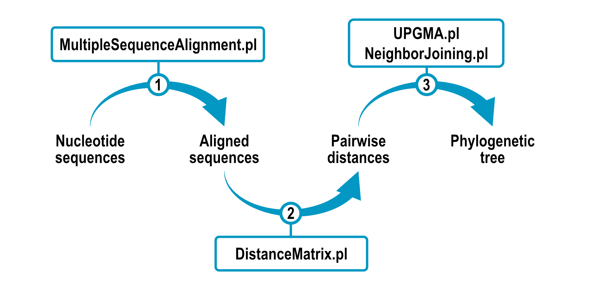

 <!---  -->


# Phylogenetic reconstruction

> This repository contains a collection of Perl scripts that can be used to infer phylogenetic relationships from molecular sequence data.
> The code was developed as a practice exercise and is provided as is for those learning and/or seeking for inspiration.
> Kindly drop a :star: if this is helpful!




## Basic examples

The usage is simple: each individual script can be run in the command line with adequate file input.

### 1. Multiple sequence alignment

Sequences are provided in fasta format to `01_MultipleSequenceAlignment.pl`. 
These are optimally aligned to have the same length and returned as stdout.

```
$ perl 01_MultipleSequenceAlignment.pl data/seqs.fa
>seq1
ATAT-CCG
>seq2
---T-CCG
>seq3
ATGTACTG
>seq4
ATGT-CTG-
```

Output can be easily stored to a new file with:

```
$ perl 01_MultipleSequenceAlignment.pl data/seqs.fa > data/aligned_seqs.fa
```

Input can also be provided in the form of individual fasta files.

```
$ perl 01_MultipleSequenceAlignment.pl data/seq1.fa data/seq2.fa data/seq3.fa data/seq4.fa
>seq1
ATAT-CCG
>seq2
---T-CCG
>seq3
ATGTACTG
>seq4
ATGT-CTG-
```

### 2. Distance matrix calculation

`02_DistanceMatrix.pl` will count pairwise differences between the aligned sequences and
return them in the form of a distance matrix.

```
$ perl 02_DistanceMatrix.pl data/aligned_seqs.fa
# seq1 | seq2 | seq3 | seq4
0       3       3       2
3       0       5       4
3       5       0       1
2       4       1       0
```
